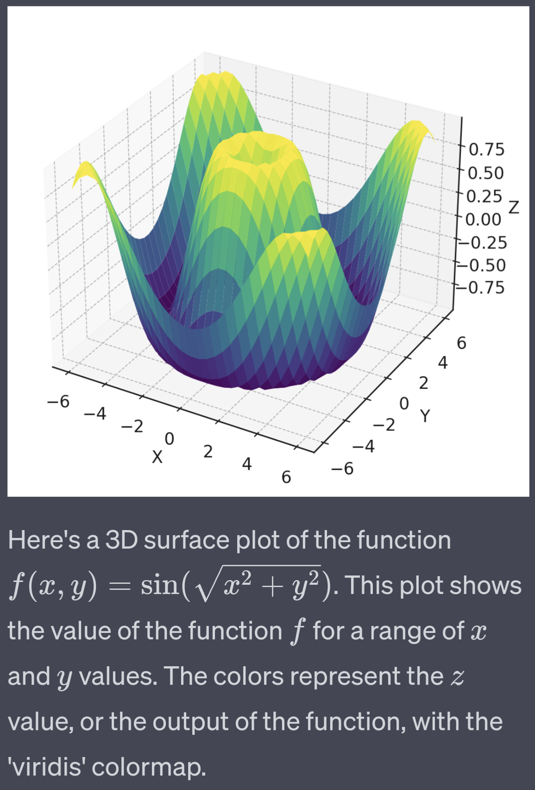
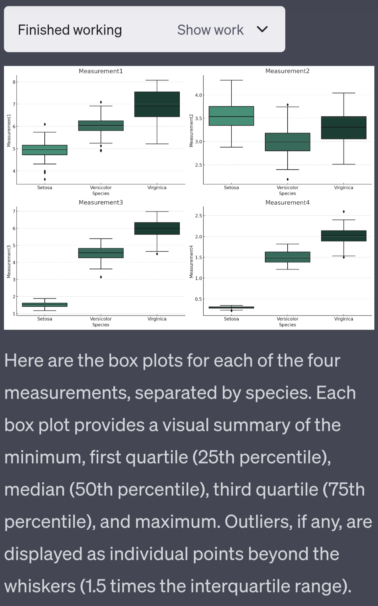
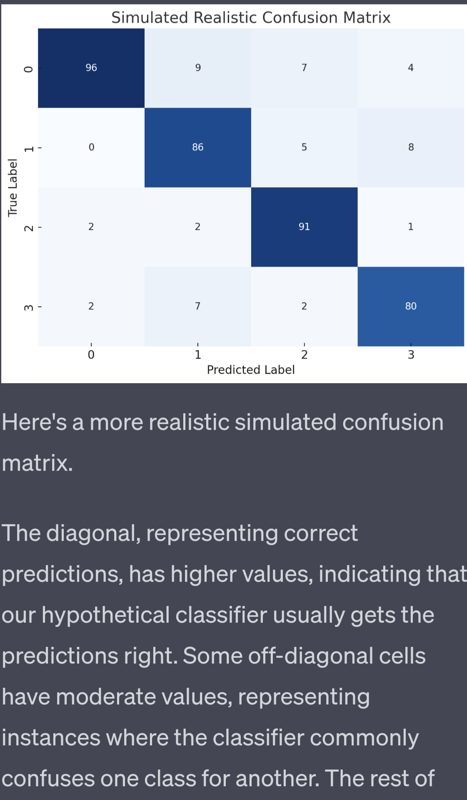
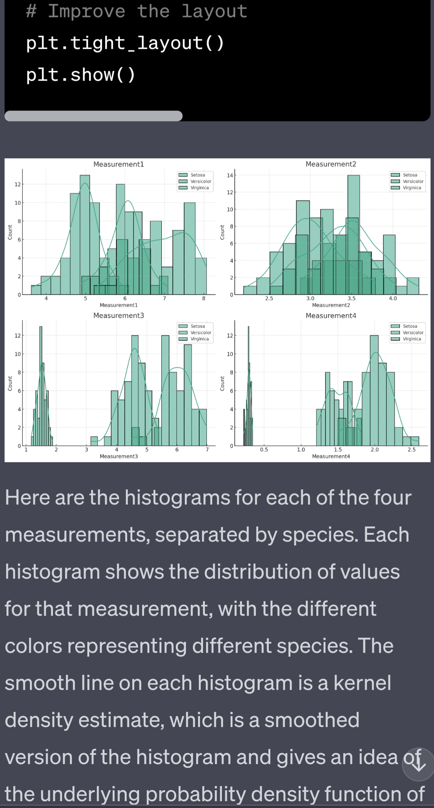
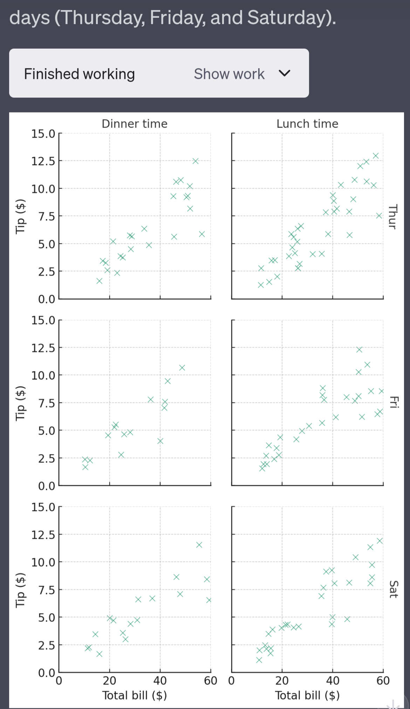
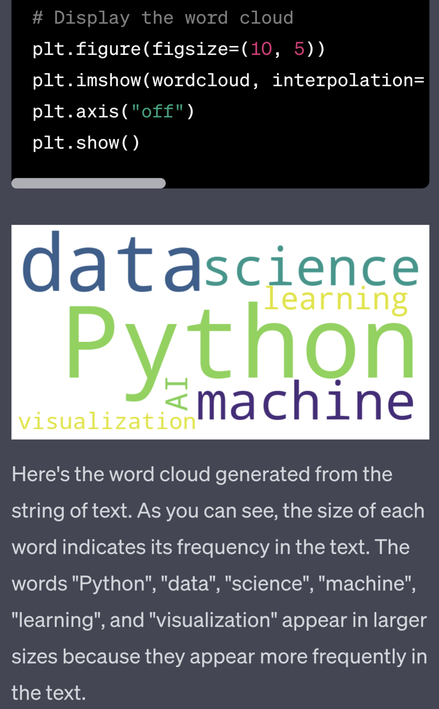

# Exploring ChatGPT Code Interpreter (CI)

*Exploring what's possible with the ChatGPT Code Interpreter and how to use it effectively.*

CI can do basically anything that's possible on a Linux box without root or internet access. With some creativity, almost any software can be ran.

If you want internet access or root permissions then check out [Pandora](https://github.com/dave1010/pandora), an open source ChatGPT plugin I made that is like an unrestricted CI.

# 1 minute guide

1. Go to https://chat.openai.com/?model=gpt-4-code-interpreter (sign up for Pro if you haven't already)
2. Enable Code Interpreter if it's not already enabled
3. Copy and paste this prompt: `List various cool and helpful things the code interpreter model can do. Then pick a couple and demo them to me. Make it really interesting.`

  
⤵️ Enabling ChatGPT Code Interpreter ⤵️

  
  | Click on your name on the bottom left, then Settings & Beta | then Beta features, then enable Code Interpreter |
| --- | --- |
|  |  |

# General info environment and limitations

## Basics

* Runs Python in a [Jupyter notebook](https://en.wikipedia.org/wiki/Project_Jupyter) environment
* Upload files. At least 50MB
* Download files. CI will provide a link like `[Link text](sandbox:/mnt/data/filename)`
* Display images

## Environment

* Current working dir: `/home/sandbox`. It doesn't know this unless you ask it to run `pwd`. Sometimes it thinks files are in `/mnt/data` when they're not.
* User `sandbox`
* Arch: `amd64`

## Hard limitations

* No root access
* No internet access
* Commands timeout after 120 seconds
* Interactive session is reset after a few minutes of inactivity
* Stored files are lost after longer inactivity

## Soft limitations

CI thinks it's just for Python but you can get it to do much more...

* It wants to just let you download files in `/mnt/data` but it can link to any file on the system readable by the user.
  This isn't particularly beneficial, as you can just copy a file there anyway.
* Run sub processes and shell commands. CI really thinks it's not able to do this.
* Run local servers, like web servers (opening a network socket, binding it to a local address and port, and accepting incoming connections.)
* Execute uploaded files

These are left as an exercise for the reader.

# What's available

* Barebones Ubuntu packages are installed. Use `dpkg -l` to list them
* Interesting packages:
  * System: `bash`, 
  * Text: `diffutils`, `graphviz`, `patch`, `poppler-utils`, `pstotext`, `vim`
  * Media:  `espeak`, `ffmpeg`, `lame`, `sox`, `tesseract-ocr`
  * Programming and building: `binutils`, `build-essential`, `cpp`, `g++`, `perl`,
  * Python: `python3`, `python3.8`, `python3-requests`
  * Networking, servers, clients: `curl`, `libmysqlclient21`, `mysql-common`, `openssl`
 
See [dpkg list](dpkg_output.txt) and [pip list](pip_packages_list.txt) for more. 

Note, Python is in the path as `python3`. CI sometimes gets this wrong and then thinks it cant run it.

# Installing other software

CI comes with lots of stuff out the box but not everything. You might need to run other software.

Here's a few handy things I've got working. Some of these are AppImage files

* [Deno](https://github.com/denoland/deno/releases) (JavaScript runtime, like Node))
* [ImageMagick](https://imagemagick.org/archive/binaries/) (magick)
* [PHP](https://github.com/scorninpc/php-gtk3/releases) (actually PHP-GTK3 but I haven't found another version that works yet)
* [Python 3.11](https://github.com/niess/python-appimage/releases) - CI comes with Python 3.8. Some packages only work with later verions like 3.11
* [pocketsphinx](https://pypi.org/project/pocketsphinx/#files) - speech recognition (requires [sounddevice](https://pypi.org/project/sounddevice/#files) )

# Interesting things it can do out the box

* Make PowerPoint files
* Read PDFs
* Edit images and videos
* Display static images in the chat
* Generate interactive visualisations (HTML download)
* OCR
* Run machine learning models
* Clean up and analyse data

  
⤵️ Image and chart generation examples ⤵️

  
| Title                     | Image                                                                           |
|---------------------------|---------------------------------------------------------------------------------|
| 3D Plot                   |                                  |
| Box Plot                  |                                |
| Cluster Map               |                          |
| Confusion Matrix          |                |
| Histogram                 |                              |
| Line Plot                 |                              |
| Mandleprod                |                            |
| Map                       |                                          |
| Network Graph             |                      |
| Radar Chart               |                          |
| Reaction Diffusion System |  |
| Scatter Plots             |                      |
| Scatterplot Matrix        |            |
| Word Cloud                |                            |

# Tips for working on code bases

* Upload a zip file
* You can get CI to give you changed files or zip up the whole code base again
* git isn't available and I haven't got it working. Dulwich, a Python library for git, is easy to get working for basic diffs and commits
* CI can also diff an original and modified code base and give you a patch file to download and apply

# Other guides

* [Mastering ChatGPT’s Code Interpreter: Comprehensive List of Python Packages in ChatGPT’s Code Interpreter](https://wfhbrian.com/mastering-chatgpts-code-interpreter-list-of-python-packages/)

# Comparison and Alternatives to Code Interpreter

|  Name                                             | ChatGPT Plugin | Stand alone | Has Internet Access | Root | Install packages? | Open Source | Notes    |
|------------|------------|---------|------|---------|--------|-----------|---|
| Code Interpreter                                              | ✅|❌| ❌  | ❌ | ~ | ❌  | Can't be ran with any other ChatGPT plugins |
| [Pandora](https://github.com/dave1010/pandora)                | ✅|❌| ✅  | ✅ | ✅  | ✅  | Runs in a local Docker container, can install packages. Made by me.  |
| [Noteable](https://noteable.io/chatgpt-plugin-for-notebook/)  | ✅|❌| ✅  | ❌ | ✅  | ❌  | Jupyter notebook, similar to ChatGPT, persists files    |
| [GPT-Code UI](https://github.com/ricklamers/gpt-code-ui)      | ❌|✅| ?   | ? | ?  | ✅  |        |

## ChatGPT plugins

* ChatGPT plugins require a Pro subscription for full access.
* You might be able to get them working with [OpenPlugin](https://github.com/CakeCrusher/openplugin/tree/main).

## OpenAI API

* Using your own API key can be very cost-effective but monitor your expenses closely.
* You could also point these to a local LLM (Llama, Falcon, StarCoder, etc) with [LocalAI](https://github.com/go-skynet/LocalAI).
